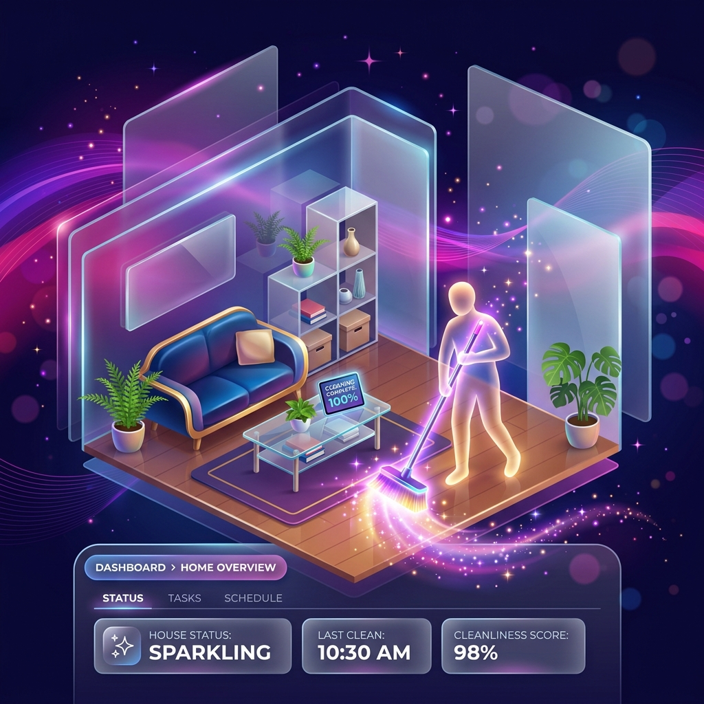
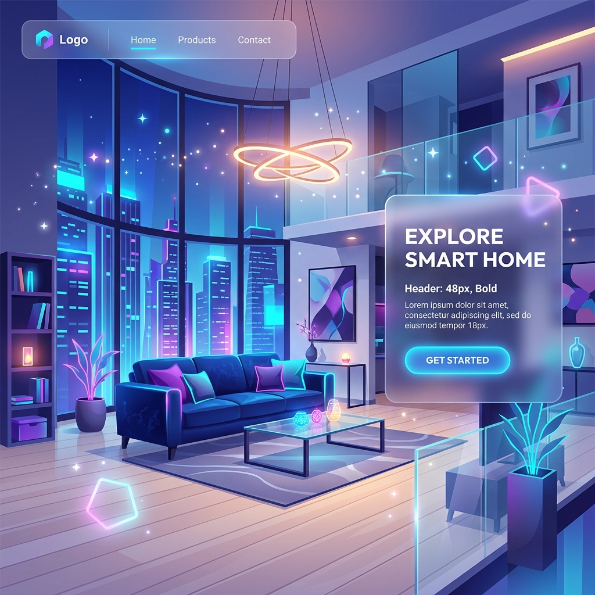
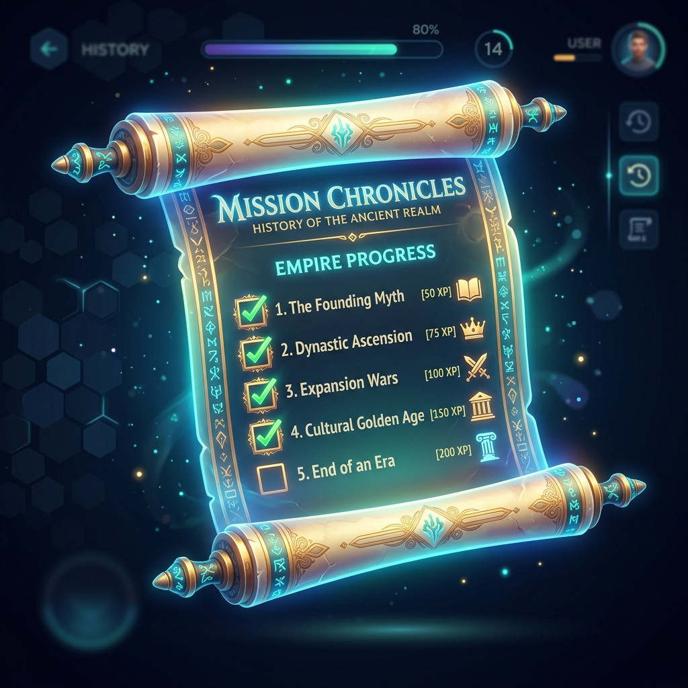

<div align="center">
  
  
  # ✨ Casa Arrumada
  
  *Transforme as tarefas domésticas em um jogo. Colabore, ganhe pontos e descubra quem é o mestre da organização no nosso ranking exclusivo!*

  [](https://angular.io/)
  [](https://nestjs.com/)
  [](https://sqlite.org/)
  [](https://www.typescriptlang.org/)
</div>

<br/>

## 🎯 Sobre o Projeto

O **Casa Arrumada** é um web app projetado para acabar com as brigas sobre quem vai lavar a louça ou tirar o lixo. A proposta é simples: usar a **gamificação** para distribuir tarefas domésticas entre os residentes de uma casa, recompensando o esforço de forma justa e divertida.

### 🌟 Principais Funcionalidades

- **Dashboard Inteligente**: Veja as tarefas da casa e quais estão aguardando um responsável.
- **Prioridades Críticas**: Lavar a louça é mais urgente? Defina tarefas de alta prioridade (que valem mais pontos e ficam no topo da lista).
- **Gamificação & Ranking**: Cada tarefa concluída rende pontos. Suba no ranking e exiba seu troféu!
- **Histórico**: Acompanhe o que você já fez em uma linda linha do tempo.

---

## 📸 Telas do Projeto

| Landing Page | Dashboard & Tarefas |
|:---:|:---:|
|  | *Dashboard responsivo e intuitivo, com Glassmorphism design.* |
| **Ranking & Gamificação** | **Histórico** |
|  |  |

---

## 🛠️ Tecnologias Utilizadas

**Frontend:**
- [Angular](https://angular.dev/) 17/18 (Standalone Components)
- RxJS & Signals
- CSS3 Custom Properties (Variáveis, Glassmorphism, Gradientes)

**Backend:**
- [NestJS](https://nestjs.com/) (Node.js framework)
- TypeORM
- Banco de Dados **SQLite** (facilitando o ambiente de desenvolvimento local, sem necessidade de Docker)
- JWT (JSON Web Tokens) para Autenticação

---

## 🚀 Como Rodar o Projeto Localmente

### Pré-requisitos
- Node.js instalado (v18+)
- NPM ou Yarn

### 1️⃣ Iniciando o Backend
Abra um terminal e navegue até a pasta `backend`:

```bash
cd backend
npm install
npm run start:dev
```
> O backend estará rodando em `http://localhost:3000`. O banco de dados SQLite será criado automaticamente.

### 2️⃣ Iniciando o Frontend
Abra outro terminal e navegue até a pasta `frontend`:

```bash
cd frontend
npm install
npm start
```
> O frontend estará rodando em `http://localhost:4200`.

---

## 📋 RoadMap

- [x] **Etapa 1 - MVP**: Cadastro de usuários, listagem e atribuição de tarefas.
- [x] **Etapa 2 - Organização**: Priorização de tarefas, design premium e Histórico de concluídas.
- [x] **Etapa 3 - Gamificação**: Sistema de pontos e tela de Ranking.
- [ ] **Etapa 4 - Balanceamento (Futuro)**: Regras para impedir que a mesma pessoa sempre faça as piores tarefas.

---

<div align="center">
  Desenvolvido com 💜 por Athos, Cauã e Marcus.
</div>
